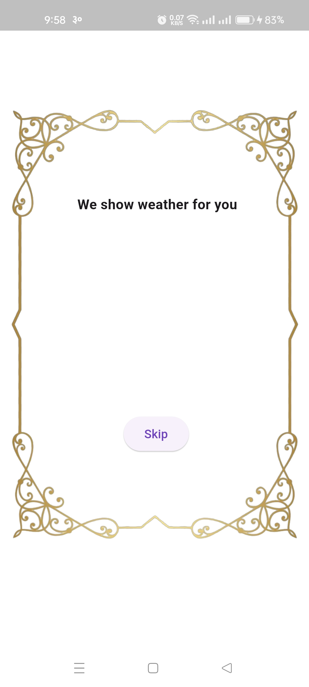
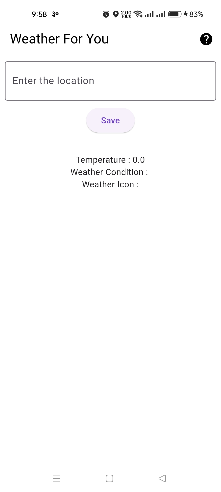
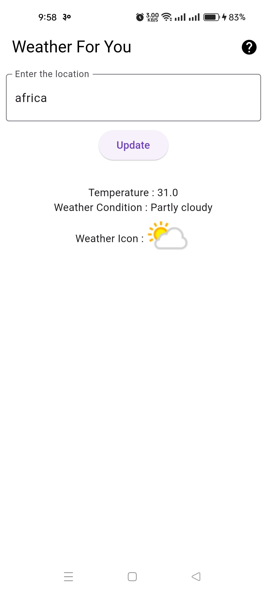
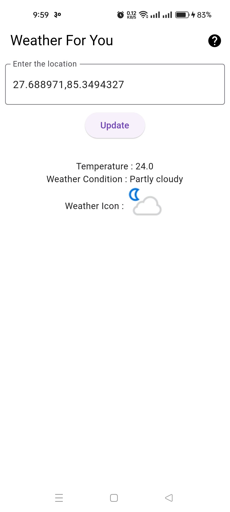
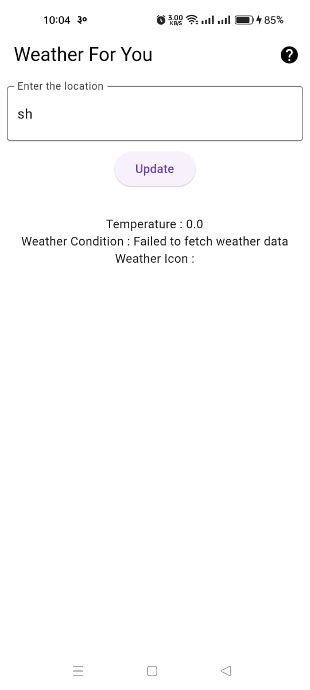

# weather_for_you

A new Flutter project.

## Getting Started

This project is a starting point for a Flutter application.

## Screenshots

*This is the splash screen which contains a text, a button and a background frame.*

*The home screen consists of a textdfield and a button and the result section which shows temperature in degree.*

*This image shows the result of searched location.*

*This image shows the result of current location.*

*This image shows the result if the location is incorrect.*

## Features

- Splash screen with image and skip button
- Main screen with a text field
- Saved text is loaded on later launches

A few resources to get you started if this is your first Flutter project:

- [Lab: Write your first Flutter app](https://docs.flutter.dev/get-started/codelab)
- [Cookbook: Useful Flutter samples](https://docs.flutter.dev/cookbook)

For help getting started with Flutter development, view the
[online documentation](https://docs.flutter.dev/), which offers tutorials,
samples, guidance on mobile development, and a full API reference.
